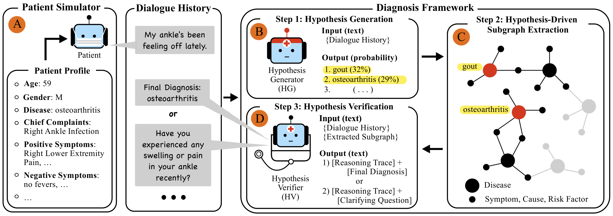

# Think Like a Doctor: Conversational Diagnosis through the Exploration of Diagnostic Knowledge Graphs

Jeongmoon Won\*, Seungwon Kook\*, Yohan Jo (Seoul National University). \*Equal contribution.

<p align="center"></p>

**KGCQ** (KG-grounded Clarifying Question generation) is a conversational diagnosis system for early clinical
encounters, where patients describe symptoms vaguely and the system must decide which clarifying question (CQ) to
ask next. Instead of relying only on an LLM's parametric knowledge, KGCQ explores a *diagnostic knowledge graph* in
three steps that repeat until a diagnosis is reached:

* **(A) Patient simulator** — a PatientSim-based simulator driven by a MIMIC-IV-ED profile (age, gender, chief
  complaint, positive/negative symptoms, histories) and a persona; we add *low-specificity symptom reporting* so that
  patients answer vaguely ("my ankle's been feeling off lately") until asked the right question.
* **(B) Step 1, Hypothesis Generation** — the dialogue history is scored by a **Hypothesis Generator (HG)**,
  Qwen2.5-7B-Instruct with a multi-label classification head over the 338 disease nodes; the top-*n* diseases become
  anchor hypotheses.
* **(C) Step 2, Hypothesis-Driven Subgraph Extraction** — a 3-hop expansion from the anchors (their attributes,
  competing diseases that share them, and those diseases' attributes), keeping competing diseases whose HG
  probability exceeds a threshold *tau*; the subgraph exposes both shared and discriminative cues.
* **(D) Step 3, Hypothesis Verification** — the **Hypothesis Verifier (HV)**, a fine-tuned Qwen2.5-7B-Instruct,
  reads the history and the linearised subgraph and emits a reasoning trace followed by either a clarifying
  question (`<question>`) or a final diagnosis of up to four diseases (`<diagnosis>`).

On 275 held-out MIMIC-IV-ED profiles the full system reaches Recall@1/2/3/4 = 0.250 / 0.361 / 0.394 / 0.418 in
6.9 turns on average, outperforming GPT-4.1-mini, Claude-3.5-Sonnet, Gemini-2.0-Flash, Llama-3.3-70B and
Qwen2.5-72B used as verifiers with the same HG and graph, as well as its own base model and an adapted
Chain-of-Diagnosis baseline. Physicians preferred the specificity-augmented simulator over PatientSim (46.3% vs
24.4%, 29.3% ties) and rated the clarifying questions highly on clinical authenticity (4.25 / 5).

## Method in more detail

**Diagnostic knowledge graph.** Built from the 48 history-taking schemas of a clinical-performance-examination
textbook and reformulated so that diseases share attribute nodes: 338 `disease` nodes connected to 847 `symptom`,
266 `cause` and 282 `risk_factor` nodes through 3,935 edges (`caused_by`, `can_cause`, `is_a_risk_factor_of`).
The shared attributes make cross-disease comparison possible, which is what discriminative questioning needs.
(`data/kg/original`; Appendix A.1.)

**Hypothesis Generator.** P(disease | H_t) = sigmoid(W · LLM_HG(H_t) + b) on the final hidden state of the last
token; trained as multi-label classification on full and randomly truncated synthetic dialogues (20% of the
dialogue length as truncation points) so that it works at every stage of the conversation. Alternatives examined in
the paper, an embedding retriever (SapBERT) and a generative HG, reach lower Recall@4 (Fig. 3). (`scripts/3_train/train_hg.py`.)

**Subgraph extraction and linearisation.** `kgcq.subgraph_extractor.extract_subgraph_3hop` performs the 3-hop
expansion with the *tau* filter; `kgcq.graph.get_subgraph_text` turns it into statements such as
`Disease 'gout' has symptoms: ['joint swelling', ...]` that are placed in the HV prompt. Table 4 of the paper sweeps
(n, tau); n = 2, tau = 0.005 is the default and gives the highest subgraph recall of the gold disease (0.559).

**Hypothesis Verifier.** Supervised fine-tuning (LoRA) on synthetic dialogues: prompt = `prompts/hv_doctor.txt`
filled with the subgraph and the history so far, target = `<think> reasoning </think>` followed by `<question>` or
`<diagnosis>`. (`scripts/3_train/train_hv.py`.)

**Patient simulator.** PatientSim's four persona dimensions (language proficiency A/B/C, personality, recall level,
confusion level) plus a *symptom specificity* trait that keeps location, character, duration, onset and
aggravating/relieving factors vague, with persona-compatibility add-ons (high recall applies only to past history;
proficient patients tend to self-diagnose; verbose patients hide missing detail behind irrelevant text). Each
response is conditioned on the profile and the latest doctor utterance. (`prompts/patientsim/`, `kgcq/simulator.py`.)
A faithfulness audit of 265 simulator turns found contradictions with the profile in 0.75% of turns (Gwet's AC1 = 0.98).

**Profiles and splits.** MIMIC-IV-ED visits with clinical notes; 20,672 profiles carry a disease label and 15,252 of
them map onto graph nodes. Stratified splits capped at 60 profiles per disease: HG 1,390 / 172 / 174, HV 1,449 / 304,
plus the 275-profile evaluation set (252 single- and 23 double-disease cases, so Recall@1 is bounded by 0.958).

**Synthetic training dialogues.** Two GPT-4o-mini instances: a clinician conditioned on the gold disease and an
oracle subgraph, instructed to behave as if the diagnosis were unknown, and the patient simulator. A hidden
grounding ratio gamma (share of the profile's symptom information that maps onto the graph) steers how strongly the
clinician relies on the subgraph versus its own knowledge, so the HV learns when graph grounding is informative.

## Main results

Diagnostic performance on the 275 evaluation profiles (Recall@k over the final diagnoses, average turns; all rows
except CoD share the same HG and graph).

| HV model | R@1 | R@2 | R@3 | R@4 | Turns |
|---|---|---|---|---|---|
| GPT-4.1-mini (parametric only) | 0.142 | 0.218 | 0.218 | 0.218 | 7.5 |
| GPT-4.1-mini + KG | 0.218 | 0.319 | 0.329 | 0.343 | 15.3 |
| GPT-4.1-mini + KG + HG | 0.243 | 0.357 | 0.376 | 0.383 | 14.1 |
| Claude-3.5-Sonnet + KG + HG | **0.267** | 0.329 | 0.345 | 0.345 | 9.4 |
| Gemini-2.0-Flash + KG + HG | 0.187 | 0.241 | 0.250 | 0.251 | 37.0 |
| Llama-3.3-70B + KG + HG | 0.186 | 0.283 | 0.306 | 0.313 | 13.9 |
| Qwen2.5-72B + KG + HG | 0.201 | 0.255 | 0.260 | 0.260 | 35.2 |
| Chain-of-Diagnosis (adapted) | 0.106 | 0.149 | 0.196 | 0.207 | **2.0** |
| Qwen2.5-7B-Instruct (base) + KG + HG | 0.173 | 0.218 | 0.218 | 0.222 | 12.4 |
| **KGCQ (ours)** | 0.250 | **0.361** | **0.394** | **0.418** | 6.9 |

Out-of-graph diseases (Sec. 6.6): adding an "Other" node lets the system flag out-of-graph cases (test OOG Recall@4
0.898) at some cost to in-graph accuracy, while expanding the graph to 528 diseases makes previously out-of-graph
diseases diagnosable (OOG Recall@4 0.194, 0.541 when any newly added disease counts) while keeping in-graph
Recall@4 at 0.414.

## Repository

```
kgcq/              library: graph, subgraph extraction, HG/HV wrappers, simulator, dialogue loops, metrics
prompts/           all prompts (HV, synthetic clinician, simulator personas, profile construction)
data/kg/           the two knowledge graphs G and G+ (public); other data are MIMIC-derived and kept local
scripts/
  2_synth/         oracle subgraphs, synthetic dialogues, HG training rows
  3_train/         train_hg.py, train_hv.py, train_hg_generative.py
  4_infer/         run_dialogue.py (kgcq | kg_only | no_kg | hg_generative), smoke_test_offline.py
  5_eval/          per-run analysis, HG standalone recall, figures, table collection
  baselines/       SapBERT retriever HG, adapted Chain-of-Diagnosis
  oog/             out-of-graph study ("Other" node, KG augmentation)
results/           aggregated numbers behind the paper's tables
figure/            framework figure
```

### Setup

```bash
# pip (Python 3.10)
python -m venv .venv && source .venv/bin/activate
pip install -r requirements.txt --extra-index-url https://download.pytorch.org/whl/cu128
# or uv (resolves torch from the cu128 index via pyproject.toml)
uv sync && source .venv/bin/activate
cp .env.example .env                                       # API keys
```

* GPT models (patient simulator `gpt-4o-mini-2024-07-18`, GPT-4.1-mini baseline, soft-label judge) are called
  through **Azure OpenAI Service**: set `AZURE_OPENAI_API_KEY`, `AZURE_OPENAI_ENDPOINT`,
  `AZURE_OPENAI_API_VERSION` and `AZURE_OPENAI_DEPLOYMENTS` (JSON map from the model ids used in the code to your
  deployment names). `KGCQ_OPENAI_PROVIDER=openai` switches to api.openai.com. The Claude / Gemini / Llama /
  Qwen-72B baselines use `OPENROUTER_API_KEY`.
* Base models `Qwen/Qwen2.5-7B-Instruct` and `all-MiniLM-L6-v2` are loaded from the Hugging Face Hub (local copies
  may be linked under `models/base`).
* Checkpoints are expected at `models/hg_qwen2.5-7b_clf_head` (HG, merged classifier) and
  `models/hv_qwen2.5-7b_sft_lora` (HV LoRA adapter); the out-of-graph adapters under `models/oog/`.
* One 80 GB GPU is enough for inference (HG + HV about 30 GB) and HG training (about 2.7 h); HV training takes
  about 5.6 h. All paths are relative to the repository root (`kgcq/paths.py`, override with `KGCQ_ROOT`).

Quick check without API keys (loads HG and HV, runs one dialogue with a scripted patient):
```bash
python scripts/4_infer/smoke_test_offline.py --gpu 0
```

### Data

Everything except the knowledge graphs derives from MIMIC-IV / MIMIC-IV-ED / MIMIC-IV-Note (PhysioNet, credentialed
access) and is not redistributed; `.gitignore` excludes it. Credentialed users can regenerate the synthetic
dialogues from the profiles with `scripts/2_synth`, or obtain the released files from the authors.

| Knowledge graph | Diseases | Symptom / Cause / Risk-factor nodes | Edges | Role |
|---|---|---|---|---|
| `data/kg/original` | 338 | 847 / 266 / 282 | 3,935 | G, all main experiments |
| `data/kg/augmented` | 528 | 1,011 / 266 / 282 | 4,974 | G+ (Table 6): 190 added diseases with LLM-mined attributes; label space and graph of the KG-augmentation setting |

Local layout expected by the scripts (MIMIC-derived):

| Path | Content |
|---|---|
| `data/profiles/{hg_train,hg_valid,hg_test,hv_train,hv_valid}.json`, `test_balanced_275.json` | profiles with persona attributes; the evaluation set yields 288 dialogues (one per chief complaint) |
| `data/dialogues/hg_{train,valid,test}.json`, `hv_train_valid.json` | synthetic dialogues (HG: 1,371 / 172 / 172 patients; HV: 1,743 patients, 2,154 dialogues) |
| `data/dialogues/training_subgraph_hv_*.json` | per-patient subgraphs used when generating the HV dialogues |
| `data/hg_softlabel/{train,valid,test}.json` | truncated histories for the HG: 8,604 / 1,051 / 1,075 rows |
| `data/retriever/`, `data/oog/` | retriever baseline inputs, out-of-graph study |

Profile fields: `age, gender, chiefcomplaint, present_illness_positive/negative, social_history,
family_medical_history, medical_history, disease, disease_mapped, likelihood_rating, found_symptoms,
gold_symptoms, chiefcomplaint_new, cefr_type, personality_type, recall_level_option, dazed_level_option`.
Dialogue files: `{pid: {"ground_truth", "subgraph", "<chief complaint>": {"diagnosis", "recall", "dialogue_length",
"dialogue", "full_process"}}}`; `full_process` keeps the reasoning traces, HG rankings and subgraphs per turn.

### Prompts

| File | Used by |
|---|---|
| `prompts/hv_doctor.txt` | Hypothesis Verifier, inference and SFT (Appendix J) |
| `prompts/hv_doctor_no_kg.txt` | parametric-knowledge-only baseline |
| `prompts/synth_doctor_gold.txt` | gold-conditioned clinician for synthetic dialogues (`{gold_disease}`, `{relevance_score}` = gamma; Appendices B, G) |
| `prompts/synth_doctor_gold_oog_other.txt` | same for out-of-graph profiles ("Other" forced first) |
| `prompts/hg_generative.txt` | generative HG baseline (Appendix C.1) |
| `prompts/patientsim/patient_low_specificity.txt`, `persona.json` | our simulator: PatientSim template + low-specificity components (Appendix H) |
| `prompts/patientsim/patient_original_patientsim.txt` | original PatientSim (baseline simulator, Sec. 6.3) |

The HG classifier template (Appendix I) lives in `kgcq.models.DiseaseDetector.create_prompt`; the symptom extractor
of the HG-free ablation in `kgcq/symptom_extractor.py`.

### Running

| Step | Script | Input -> output |
|---|---|---|
| 2a Oracle subgraphs | `scripts/2_synth/build_oracle_subgraphs.py` | profiles -> per-patient subgraph for the synthetic clinician |
| 2b Synthetic dialogues | `scripts/2_synth/generate_dialogues.py` | profiles + subgraphs -> dialogues |
| 2c HG rows | `scripts/2_synth/build_hg_softlabel.py` | dialogues -> truncated histories (Recall@4 >= 0.5 filter) |
| 3a HG | `scripts/3_train/train_hg.py` | rows -> classification head (LoRA r16, lr 1e-5, 10 epochs, early stop on Recall@4) |
| 3b HV | `scripts/3_train/train_hv.py` | HV dialogues -> LoRA adapter (lr 1e-5, 2 epochs, prompt tokens masked) |
| 4 Inference | `scripts/4_infer/run_dialogue.py` | evaluation profiles -> `runs/<tag>/dialog.json`, `metrics.json` (resumable) |
| 5 Analysis | `scripts/5_eval/summarize_run.py`, `collect_tables.py`, `plot_robustness.py`, `plot_hg_recall.py`, `eval_hg_standalone.py` | persona breakdown, HG / subgraph recall, figures |

Defaults reproduce the paper (patient = gpt-4o-mini, 50-turn cap, n = 2, tau = 0.005):
```bash
python scripts/3_train/train_hg.py --output_dir models/hg_qwen2.5-7b_clf_head --gpu 0
python scripts/3_train/train_hv.py --output_dir models/hv_qwen2.5-7b_sft_lora --gpu 0,1
# KGCQ
python scripts/4_infer/run_dialogue.py --mode kgcq --hv_backend local_finetuned --tag kgcq_n2_tau0.005 --gpu 0
python scripts/5_eval/summarize_run.py --run runs/kgcq_n2_tau0.005
# GPT-4.1-mini as verifier: parametric only / +KG (no HG, symptom-anchored 2-hop) / +KG+HG
python scripts/4_infer/run_dialogue.py --mode no_kg   --hv_backend openai --hv_model gpt-4.1-mini --tag gpt41mini_no_kg
python scripts/4_infer/run_dialogue.py --mode kg_only --hv_backend openai --hv_model gpt-4.1-mini --top_k 1 --tag gpt41mini_kg_only
python scripts/4_infer/run_dialogue.py --mode kgcq    --hv_backend openai --hv_model gpt-4.1-mini --tag gpt41mini_kg_hg
# other API verifiers, e.g.
python scripts/4_infer/run_dialogue.py --mode kgcq --hv_backend openrouter --hv_model anthropic/claude-3.5-sonnet --tag kgcq_hv_claude
python scripts/5_eval/collect_tables.py runs/*      # Recall@1-4 / turns; no arguments: the released numbers
```
On a SLURM cluster, submit the launchers from the repository root (`sbatch slurm/train_hg.sh`); they locate
the repository through `SLURM_SUBMIT_DIR`.

Scoring: free-text diagnoses are mapped to graph nodes by exact match or embedding similarity > 0.9; Recall@k is
averaged over dialogues and filled only for k >= |gold| (`kgcq/metrics.py`).

### Reproduction map

| Paper | Command / script | Released numbers |
|---|---|---|
| Table 2 (ablation) | `run_dialogue.py --mode no_kg \| kg_only \| kgcq --hv_backend openai --hv_model gpt-4.1-mini` | `results/main/table2_*` |
| Table 3 (verifiers) | `--hv_backend openrouter \| local \| local_finetuned`; CoD: `scripts/baselines/cod/` | `results/main/table3_*` |
| Table 4 (n, tau; HG Recall@k, Sub Recall) | `--top_k n --tau t`, then `summarize_run.py` | `results/main/table4_*/metrics_anal.json` |
| Fig. 3 (HG architectures) | `eval_hg_standalone.py`, `scripts/baselines/retriever/retrieve_eval.py`, `plot_hg_recall.py` | `results/hg_standalone/` |
| Fig. 5 (persona robustness) | `summarize_run.py` on three runs, `plot_robustness.py` | `results/main/*/metrics_anal.json` |
| Table 5, 9-11 (out-of-graph) | `scripts/oog/` | `results/oog/final_tables/`, `relaxed_oog_recall*.csv` |
| Table 6 (graph statistics) | `data/kg/` | table above |
| Table 7 (HG methods end-to-end) | `--mode hg_generative`; retriever runs not preserved | `results/main/table7_generative_hg_ft` |

`results/main/<row>/metrics.json` holds Recall@1-4 and turns of the run behind each table row (`provenance.txt`
names the original runs); `results/oog/` the out-of-graph tables; `results/hg_standalone/` the HG test metrics
(classification head 0.338 / 0.444 / 0.521 / 0.560 at k = 1..4); `results/retriever/` the SapBERT encoder sweeps.

### Reproduction check

The pipeline was re-run from a clean checkout (environment from `uv sync`, one A100-80GB per SLURM job, released
MIMIC-derived data): HG training 1h32m (early-stopped at epoch 6), HV training 6h06m, inference on the 288
evaluation dialogues 2h09m. `results/reproduction/` holds the metrics.

| | R@1 | R@2 | R@3 | R@4 | Turns | Sub Recall |
|---|---|---|---|---|---|---|
| KGCQ, released run (Table 3) | 0.250 | 0.361 | 0.394 | 0.418 | 6.9 | 0.559 |
| KGCQ, retrained from scratch | 0.212 | 0.328 | 0.401 | 0.444 | 7.2 | 0.698 |
| HG standalone, released (Fig. 3) | 0.338 | 0.444 | 0.521 | 0.560 | | |
| HG standalone, retrained | 0.310 | 0.436 | 0.506 | 0.559 | | |

Run-to-run variation of this size is expected: training is seeded but not bit-reproducible on GPU, the patient
simulator samples at temperature 0.8, and the HG's probability calibration changes the number of diseases that pass
tau (the retrained HG yields about 40 subgraph lines per turn versus about 22 for the released one).

### Out-of-graph study

"Other" node = `exp5` (HG labels 338 + Other, graph `paper`), KG augmentation = `exp6` (528 labels, inference on
`augmented`); `exp3`/`exp4` are the pilot sweep. Final models: `exp5_hg_r30` + `exp5_hv_r25_symcentric`, and
`exp6_hg_r35` + `exp6_hv_r30_symcentric_v3a`. The OOG experiments linearise subgraphs attribute-centrically
(`'s' is a symptom of [d1, d2]`, `fmt="symptom"`).

```bash
cd scripts/oog
python 3_train/train_hg_exp34.py exp5 30 0                          # <exp> <ratio> <gpu>; exp6 35 likewise
python 3_train/train_hv_exp34.py exp5 25 0 symcentric
python 4_eval/build_hv_v3subgraph_data.py --gpu 0 --hg_ratio 35     # exp6 HV training subgraphs on augmented (HG-predicted)
HV_DATA_DIR=../../data/oog/train/data_exp6_hv_v3a HV_TAG=_v3a python 3_train/train_hv_exp34.py exp6 30 0 symcentric
python 4_eval/eval_hg_valid.py 0 --exp exp5,exp6 --ratios 30,35     # validation top-4 of the HG adapters (HG table)
python 4_eval/eval_paper_hg.py 0                                    # main-pipeline HG on the OOG eval sets (PAPER_HG_DIR to override)
python 4_eval/inference_exp34.py --exp exp5 --hg_ratio 30 --hv_ratio 25 --gpu 0 --id_set balanced --ood_set clean243 \
    --hv_dir ../../models/oog/exp5_hv_r25_symcentric_Qwen2.5-7B --subgraph_method paper3hop --tau 0.005 --subgraph_format symptom --tag_suffix _sweep
python 4_eval/inference_exp34.py --exp exp6 --hg_ratio 35 --hv_ratio 30 --gpu 0 --kg augmented --id_set balanced --ood_set clean243 \
    --hv_dir ../../models/oog/exp6_hv_r30_symcentric_v3a_Qwen2.5-7B --subgraph_method paper3hop --tau 0.005 --subgraph_format symptom --tag_suffix _v3a
python 4_eval/make_hg_csv_3to1.py; python 4_eval/make_pipeline_csv.py valid; python 4_eval/make_pipeline_csv.py test
python 4_eval/make_seed9_inference_results.py; python 4_eval/compute_relaxed_oog_recall.py; python 4_eval/make_exp6_recognition_recall.py
```
`--id_set valid --ood_set valid128` runs the validation sets used for ratio selection. The expanded graph G+
(`data/kg/augmented`) adds 190 diseases with attributes mined from diagnostic schemas (Appendix A.2).
Evaluation sets: ID = the 275 profiles, OOG = 243 clean test profiles reported on a 98-case prevalence-matched
subsample; validation 304 + 128. Training sets (`data/oog/train/data_exp{5,6}[_hv][_v3a]`, HG eval sets
`{valid,test}_combined.json`) are part of the data package. All OOG scripts share `scripts/oog/_paths.py` (data in
`data/oog`, adapters in `models/oog`, outputs in `results/oog`).

### Baselines

* **SapBERT retriever HG** (`scripts/baselines/retriever/`, Appendix C.2): `extract_symptoms_from_dialogue.py` /
  `create_test_dataset.py` extract positive and negative symptoms with GPT-4o-mini; `train_retriever.py` fine-tunes
  the encoder on (symptom query, disease attribute document) pairs; `retrieve_eval.py` reports standalone Recall@k;
  `retrieve_utils.py` implements the rerank rule `Sim(S_pos, D) - 0.3 * Sim(S_neg, D)`.
* **Adapted Chain-of-Diagnosis** (`scripts/baselines/cod/cod_cli.py`, Appendix D): the CoD chatbot with its disease
  database rebuilt from our graph (each candidate disease -> its 1-hop attributes in CoD's text format), retrieval
  size 20, confidence threshold 0.5 (0.55 and 0.6 also swept). Needs the CoD model and retriever assets.

### Known gaps and provenance notes

* **Not preserved:** the end-to-end runs with the retriever as HG (Table 7, Rerank O/X), the Chain-of-Diagnosis
  driver, the generative-HG adapter and the SapBERT retriever weights (the latter two are retrainable).
* `predicted_diseases` in the HG rows (GPT-4.1-mini judge) is stored as an unordered set; its standalone Recall@1 is
  taken from `results/hg_standalone/test_softlabel_metric_gpt_vs_qwen.json`.

## Citation

```bibtex
@article{won2026kgcq,
  title   = {Think Like a Doctor: Conversational Diagnosis through the Exploration of Diagnostic Knowledge Graphs},
  author  = {Won, Jeongmoon and Kook, Seungwon and Jo, Yohan},
  year    = {2026}
}
```
